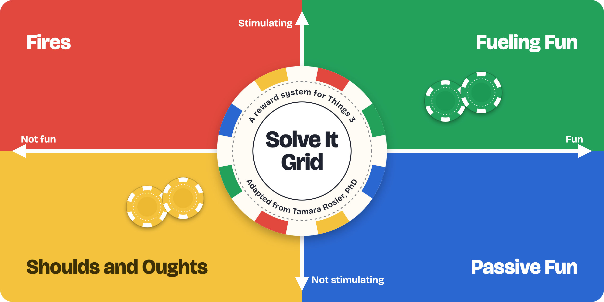
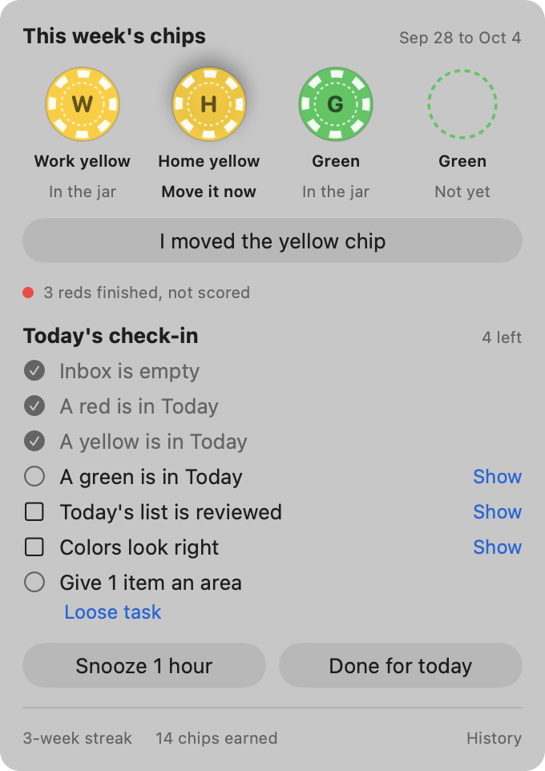

<p align="center">
  
</p>

# Solve It Grid for Things

A small reward system for [Things 3](https://culturedcode.com/things/), built around the ADHD Solve It Grid. Every to-do gets a grid color, and each week a few yellow and green to-dos earn real poker chips that you move from one jar to another the moment you earn them.

## The Solve It Grid

The Solve It Grid comes from Tamara Rosier, PhD, in her book *Your Brain's Not Broken*. It sorts what you do on two axes, how fun it is and how stimulating it is:

| | Not fun | Fun |
|---|---|---|
| **Stimulating** | 🔴 **Fires**: deadlines, emergencies, someone waiting on you | 🟢 **Fueling Fun**: exercise, friends, creative projects |
| **Not stimulating** | 🟡 **Shoulds and Oughts**: laundry, taxes, admin | 🔵 **Passive Fun**: TV, scrolling, games |

Red is easy to start because urgency switches the ADHD brain on, but it's draining. Blue is where you go to recover, but it recharges you slowly. Left alone, days slide back and forth between the two, while yellow piles up and green, the stuff that actually gives energy back, gets squeezed out. The fix is to start in green and spend that energy on yellow. [This write-up](https://www.thecenterforadhd.com/adhd-energy-balance-solve-it-grid/) is a good five-minute read.

## Why this exists

Knowing the grid is one thing. Steering a real week toward yellow and green is another. So this rewards only those two:

- **Red is never rewarded.** It gets done anyway, and rewarding it would reward crisis mode.
- **Blue stays off the list.** Passive downtime doesn't need a to-do.
- **A small weekly goal.** 1 work yellow, 1 home yellow and 2 greens.
- **A reward you can hold, right away.** Each of those earns a physical poker chip the moment it's done. Moving it to the done jar is the reward, and the jar is the scoreboard.
- **No extra bookkeeping.** Claude colors your to-dos in the background, so it all runs on the Things list you already keep. A short daily check-in keeps that list healthy.

## How it works

- Every to-do gets one emoji tag: 🔴 🟡 🟢 🔵, or ⚪ for list entries that aren't really tasks. Claude (through the Claude Code CLI) assigns them every 10 minutes, and anything you tag by hand is left alone.
- A ring in the menu bar (or `solve-it-grid status`) shows the week's four units and tells you when to move a chip.
- On workdays, the check-in has you empty the Inbox and put a red, a yellow and a green in Today.

<p align="center">
  <picture>
    <source media="(prefers-color-scheme: dark)" srcset="docs/assets/popover-dark.png">
    
  </picture>
</p>

## Get started

You'll need a Mac, Things 3 with Things URLs turned on, [Claude Code](https://claude.com/claude-code) logged in, and [uv](https://docs.astral.sh/uv/).

```bash
git clone https://github.com/timfurlong/solve-it-grid.git
cd solve-it-grid
uv tool install --editable ./engine
solve-it-grid setup --no-agent
```

Nothing is written to Things until you've reviewed Claude's first batch of colors. The [setup guide](docs/setup.md) walks through that review, the background agent and the menu bar app.

## Docs

- [Setup](docs/setup.md): install, first review, Full Disk Access, the menu bar app
- [Using Solve It Grid](docs/usage.md): colors, goals and chips, the check-in, the ring, commands, tuning
- [How it works](docs/how-it-works.md): architecture, the categorizer, privacy
- [Development](docs/development.md): layout, tests, contributing
- [Design spec](docs/specs/2026-09-28-solve-it-grid-design.md)

## Privacy

To-do titles, the start of their notes, and project and heading names are sent to Claude for classification. Everything else stays on your Mac. See [Privacy](docs/how-it-works.md#privacy) for exactly what's stored where.

## Credits and license

The Solve It Grid is Tamara Rosier's framework, from *Your Brain's Not Broken*. This project isn't affiliated with her or with Cultured Code, the makers of Things.

MIT. See [LICENSE](LICENSE).
